<div align="center">



</div>

```ansi
[1;32mselim@warsaw[0m:[1;34m~[0m$ cat skills.txt
ml/ds      → pandas · NumPy · scikit-learn · XGBoost · matplotlib
backend    → Python · FastAPI · SQLAlchemy · Pydantic · REST APIs
ai-eng     → Claude & OpenAI APIs · tool use / agents · structured output · prompt design
cloud      → AWS (EC2 · RDS · S3 · CloudFront · SES) · Docker · GitHub Actions CI/CD
db         → PostgreSQL · SQLite · OracleSQL
langs      → Python · Java · TypeScript · SQL
```

```ansi
[1;32mselim@warsaw[0m:[1;34m~[0m$ ls projects/ --featured
```

**[semesta/](https://app.cognitivemaxxing.com)** — flagship. Full-stack study OS, designed, built & deployed solo. **[live ↗](https://app.cognitivemaxxing.com)**
- Research-based **Cognitive Load Engine** — power-law duration scaling, mastery discounting, fatigue modeling
- **AI-native:** Claude API for in-app features + a custom **MCP server** exposing the study system as tools any AI agent can drive
- **FastAPI + PostgreSQL + SQLAlchemy**, Alembic migrations, **500+ pytest tests**
- **React** frontend, Google OAuth + JWT auth
- **AWS** (EC2 · RDS · S3 · CloudFront · SES) behind Nginx, GitHub Actions CI/CD

**[my-life-be-like/](https://github.com/tyudope/my-life-be-like)** — Claude agent with tool use over PostgreSQL. "Should I add weight to bench?" → queries real training history, answers from the numbers. Nothing hardcoded.

**[ai-engineering-lab/](https://github.com/tyudope/ai-engineering-lab)** — reliable LLM backend services: DreamSense (output contracts, guardrails), AI DJ (schema validation), Uber Meal Recommender (DB-context prompts), Study with AI (LLM wrapper pattern, DI). FastAPI · Pydantic v2 · OpenAI API.

**[perfume-recommender/](https://perfume-recommender-vj81.onrender.com)** — hybrid ML ranking (cosine similarity + weighted scoring) with GPT-4o-mini explanations. Dockerized, rate-limited, live on Render.

**[THRESHOLD/](https://github.com/tyudope/THRESHOLD)** — Papers-Please-inspired game, pure Python stdlib. Composition over inheritance, functional core / imperative shell, terminal + tkinter UI on one domain layer.

**[feynmannAI/](https://github.com/tyudope/feynmannAI)** — Feynman-method AI chatbot: you explain, it probes gaps. TypeScript · Next.js · Anthropic API.

```ansi
[1;32mselim@warsaw[0m:[1;34m~[0m$ ls fundamentals/
selimkit-learn/          ML & linear algebra from scratch (Mathematics for ML)
hands-on-ml-geron/       Hands-On ML notes & experiments (Géron)
fluent-python-journey/   deep Python (Ramalho)
dsa-and-algorithms/      data structures & algorithms from scratch
pandas-leetcode-30-day/  30-day pandas challenge
diamond-analysis/        EDA — what drives diamond pricing
```

<sub>[selimkit-learn](https://github.com/tyudope/selimkit-learn) · [hands-on-ml-geron](https://github.com/tyudope/hands-on-ml-geron) · [Fluent-Python-journey](https://github.com/tyudope/Fluent-Python-journey) · [dsa-and-algorithms](https://github.com/tyudope/dsa-and-algorithms) · [pandas-leetcode-30-day](https://github.com/tyudope/pandas-leetcode-30-day) · [diamond-analysis](https://github.com/tyudope/diamond-analysis)</sub>

```ansi
[1;32mselim@warsaw[0m:[1;34m~[0m$ ./stats
```

 

<a href="https://leetcode.com/u/dopesthetic/"></a>

```ansi
[1;32mselim@warsaw[0m:[1;34m~[0m$ ping selim
→ [1;37mlinkedin.com/in/selimdalcicek[0m
→ [1;37mselimdalcicek1912@gmail.com[0m
→ [1;37mleetcode.com/u/dopesthetic[0m
connection established. 0% packet loss.
```

[LinkedIn](https://www.linkedin.com/in/selimdalcicek/) · [Email](mailto:selimdalcicek1912@gmail.com) · [LeetCode](https://leetcode.com/u/dopesthetic/)
